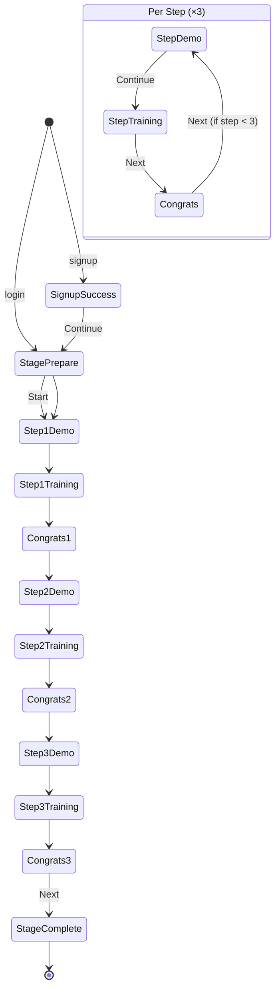

# Vertigo Training — Website Implementation Spec

> Source: Figma file [Vertigo Training](https://www.figma.com/design/SuwRhAsAZLIjc2AWhtCibX/Vertigo-Training)  
> Prototype page: `node-id=1-2`  
> Wireframe page: `node-id=57-512`

## 1. Product summary

**App:** Interactive Vestibular Rehabilitation Therapy (自我練習工具)  
**Basis:** CUHK guidelines — self-practice only, not medical advice  

**Disclaimer (show on Sign Up):**

> This is a self-practice tool based on CUHK guidelines. It is NOT a substitute for medical advice. Stop immediately if symptoms worsen.

**Locales:** `en` | `zh-Hant` | `zh-Hans`  
**Themes:** `light` | `dark`  
**Sound:** `on` | `off` (global toggle)

---

## 2. Global app state

```ts
type Locale = 'en' | 'zh-Hant' | 'zh-Hans';
type Theme = 'light' | 'dark';
type Sound = 'on' | 'off';

type AuthState =
  | { status: 'anonymous' }
  | { status: 'authenticated'; userId: string; displayName: string };

type TrainingPhase = 'prepare' | 'demo' | 'training' | 'congrats';

type AppState = {
  locale: Locale;
  theme: Theme;
  sound: Sound;
  auth: AuthState;

  // Training session (only when in training flow)
  stage: number;           // currently only stage 1
  step: 1 | 2 | 3;
  phase: TrainingPhase;

  // Per-step metrics (filled after training phase)
  stepResults: Partial<Record<1 | 2 | 3, StepMetrics>>;
};

type StepMetrics = {
  completionPct: number;   // 0–100
  accuracyPct: number;     // 0–100
  averageAngleDeg: number; // e.g. 15
};
```

**Persistence (recommended):**

- `locale`, `theme`, `sound` → `localStorage`
- `auth` → session/token
- Training progress → in-memory during session; optionally persist `stepResults`

---

## 3. Route map

| Route | Screen ID | Access |
|---|---|---|
| `/` | `start` | public |
| `/login` | `login` | public |
| `/signup` | `signup` | public |
| `/signup/success` | `signup-success` | after signup |
| `/training/stage/:stage/prepare` | `stage-prepare` | authenticated |
| `/training/stage/:stage/step/:step/demo` | `step-demo` | authenticated |
| `/training/stage/:stage/step/:step` | `step-training` | authenticated |
| `/training/stage/:stage/complete` | `stage-complete` | authenticated |

**Modals (not routes, or optional query `?modal=language|congrats`):**

- `language-picker`
- `congrats` (overlay after each training step)

---

## 4. Global chrome (every main screen)

Present on all screens except modals:

| Control | ID | Behavior |
|---|---|---|
| Logo | `logo` | Link to `/` or no-op if in training |
| Language | `language-btn` | Opens `language-picker` modal |
| Sound | `sound-btn` | Toggle `sound` on ↔ off |
| Dark/Light | `theme-btn` | Toggle `theme` light ↔ dark |

**Language picker modal:**

- Options: English → `en`, 繁體中文 → `zh-Hant`, 简体中文 → `zh-Hans`
- On select: set `locale`, close modal, stay on equivalent screen (re-render copy)
- Close (X): dismiss without change

---

## 5. Screen specs

### 5.1 `start`

**Purpose:** Landing + language-specific entry to login

**Content:**

- Title EN: `Interactive Vestibular Rehabilitation Therapy`
- Subtitle ZH: locale-specific (see i18n §8)
- 3 start buttons (each sets locale AND navigates to login):

| Button label | Sets locale | Navigates to |
|---|---|---|
| `Start` | `en` | `/login` |
| `開始` | `zh-Hant` | `/login` |
| `开始` | `zh-Hans` | `/login` |

**Actions:**

- `language-btn` → language modal
- `theme-btn` → flip theme
- `sound-btn` → flip sound

---

### 5.2 `login`

**Fields:**

- `username` (text)
- `password` (password)

**Buttons:**

- Primary: Log In → authenticate → on success go to `/training/stage/1/prepare`
- Secondary: Sign Up → `/signup`

**Actions:** global chrome only

**Field UX:** on focus → “filled” visual state (border/highlight)

---

### 5.3 `signup`

**Fields:**

- `username`
- 3× additional text fields (profile/metadata — exact labels TBD; keep as generic `field1`, `field2`, `field3` unless copy is finalized)
- `password`
- `terms` checkbox (required)

**Disclaimer:** show CUHK disclaimer at bottom

**Buttons:**

- Submit (disabled until `terms` checked) → create account → `/signup/success`

**Actions:** global chrome

---

### 5.4 `signup-success`

**Content:** success message (locale-specific)

**Button:** Continue → `/training/stage/1/prepare`

---

### 5.5 `stage-prepare` (Stage N intro)

**Currently:** only `stage = 1`

**Content:**

- Title: e.g. `Stage 1: Prepare` / `第一級：準備` / `第一级：准备`
- Head illustration (static)
- Instructional area (card with head graphic)

**Button:** `Start` → set `{ step: 1, phase: 'demo' }` → `/training/stage/1/step/1/demo`

---

### 5.6 `step-demo` (Video demo — BEFORE training)

**Order rule:** demo always precedes training.

**Content:**

- Title: `Stage {stage}: Step {step}` (localized)
- Video area (embed or `<video>`; Figma uses static image placeholder)
- Global chrome

**Button:** `Continue` / `Next` → set `phase: 'training'` → `/training/stage/{stage}/step/{step}`

**No metrics yet.**

---

### 5.7 `step-training` (Interactive training)

**Content:**

- Title: `Stage {stage}: Step {step}`
- Head component (interactive — user performs vestibular exercise)
- Angle markers (`A` positions — top/bottom in design; bind to exercise targets)
- Global chrome

**Behavior:**

- Track user performance during session
- On complete, compute `StepMetrics` and store in `stepResults[step]`

**Button:** `Next` → set `phase: 'congrats'` → open `congrats` modal (stay on same route or use overlay state)

---

### 5.8 `congrats` (modal overlay — after EACH training step)

**Trigger:** end of `step-training`, not after demo.

**Content:**

- Title: `Way to go!` (localized)
- Summary (dynamic from `stepResults[step]`):

```
Completion: {completionPct}%
Accuracy: {accuracyPct}%
Average angle: {averageAngleDeg}°
```

**Button:** `Next`

**Logic:**

```ts
function onCongratsNext(state: AppState): string {
  if (state.step < 3) {
    return `/training/stage/${state.stage}/step/${state.step + 1}/demo`;
    // next step starts with DEMO, not training
  }
  return `/training/stage/${state.stage}/complete`;
}
```

Update state: `step++`, `phase = 'demo'`, close modal.

---

### 5.9 `stage-complete`

**After Step 3 congrats → Next**

**Content:** stage completion message (design TBD; can reuse congrats layout with final summary of all 3 steps)

**Actions:** return home, logout, or restart stage

---

## 6. Training flow state machine



**Critical rule:**  
`prepare → demo → training → congrats` repeats for steps 1, 2, 3.  
Never skip demo. Never show congrats after demo.

---

## 7. Step loop (pseudocode)

```ts
const STEPS = [1, 2, 3] as const;

function startStage(stage: number) {
  return { stage, step: 1, phase: 'prepare' as const };
}

function onPrepareStart(state: AppState) {
  return { ...state, step: 1, phase: 'demo' as const };
}

function onDemoContinue(state: AppState) {
  return { ...state, phase: 'training' as const };
}

function onTrainingComplete(state: AppState, metrics: StepMetrics) {
  return {
    ...state,
    phase: 'congrats' as const,
    stepResults: { ...state.stepResults, [state.step]: metrics },
  };
}

function onCongratsNext(state: AppState) {
  if (state.step < 3) {
    return { ...state, step: (state.step + 1) as 1 | 2 | 3, phase: 'demo' as const };
  }
  return { ...state, phase: 'prepare' as const }; // or navigate to stage-complete
}
```

---

## 8. i18n keys (minimum)

```ts
const copy = {
  en: {
    appTitle: 'Interactive Vestibular Rehabilitation Therapy',
    appSubtitle: '治療眩暈（頭暈）練習操',
    start: 'Start',
    login: 'Log In',
    signup: 'Sign Up',
    signupSuccess: "Signed up successfully! You're all set.",
    stagePrepare: 'Stage {n}: Prepare',
    stageStep: 'Stage {n}: Step {m}',
    continue: 'Continue',
    next: 'Next',
    congratsTitle: 'Way to go!',
    completion: 'Completion',
    accuracy: 'Accuracy',
    averageAngle: 'Average angle',
    disclaimer:
      'This is a self-practice tool based on CUHK guidelines. It is NOT a substitute for medical advice. Stop immediately if symptoms worsen.',
    terms: 'I agree & understand the terms & conditions',
  },
  'zh-Hant': {
    appTitle: 'Interactive Vestibular Rehabilitation Therapy',
    appSubtitle: '治療眩暈（頭暈）練習操',
    start: '開始',
    signupSuccess: '註冊成功～ 一切準備就緒',
    stagePrepare: '第一級：準備',
    stageStep: '第一級：第{m}部分',
  },
  'zh-Hans': {
    start: '开始',
    signupSuccess: '注册成功～ 一切准备就绪',
    stagePrepare: '第一级：准备',
    stageStep: '第一级：第{m}部分',
  },
};
```

---

## 9. Component library

| Component | Props / variants | Notes |
|---|---|---|
| `AppShell` | `locale`, `theme`, `sound`, `onLanguage`, `onTheme`, `onSound` | layout + chrome |
| `Button` | `variant: primary \| secondary`, `hover`, `label` | 200×80, rounded 20px |
| `TextField` | `state: empty \| filled \| focused` | 600×100 |
| `Checkbox` | `checked` | terms on signup |
| `LanguageModal` | `locale`, `onSelect`, `onClose` | 3 language buttons + close |
| `CongratsModal` | `metrics: StepMetrics`, `onNext` | overlay |
| `HeadExercise` | `step`, `onComplete(metrics)` | interactive training core |
| `VideoDemo` | `src`, `step` | demo phase only |
| `Card` | bordered container | main content panel |

---

## 10. Design tokens (from Figma)

```css
:root {
  --color-blue: #2949cc;
  --color-cyan: #10a69c;
  --color-dark-blue: #111d4d;
  --color-yellow: #fff600;
  --font-family: 'Noto Sans', sans-serif;
  --radius-card: 20px;
  --border-width: 3px;
  --viewport-width: 1280px;
  --viewport-height: 832px;
}
```

**Light theme:** white background, blue borders/text  
**Dark theme:** inverted backgrounds — mirror light layout with dark palette

---

## 11. Auth API shape (stub)

```ts
POST /api/auth/login     { username, password } → { token, user }
POST /api/auth/signup    { username, password, field1, field2, field3 } → { token, user }
POST /api/training/step  { stage, step, metrics } → { ok }  // optional persist
```

---

## 12. Suggested file structure

```
src/
  app/
    page.tsx                    # start
    login/page.tsx
    signup/page.tsx
    signup/success/page.tsx
    training/
      stage/[stage]/
        prepare/page.tsx
        step/[step]/
          demo/page.tsx
          page.tsx              # training
        complete/page.tsx
  components/
    AppShell.tsx
    Button.tsx
    LanguageModal.tsx
    CongratsModal.tsx
    HeadExercise.tsx
    VideoDemo.tsx
  lib/
    state.ts                    # AppState + reducers
    i18n.ts
    training-flow.ts            # state machine helpers
  styles/
    tokens.css
```

---

## 13. Figma vs implementation

| Logic piece | Figma | Build in code |
|---|---|---|
| Steps 1–3 demo → training → congrats | Partial (Step 1 only) | All 3 steps |
| Step 2 & 3 screens | Missing | Generate from Step 1 template |
| Metrics in congrats | Static placeholder | Dynamic from `HeadExercise` |
| 3 locales × 2 themes | Separate frames | Single components + `locale`/`theme` state |
| Hover/focus micro-interactions | 324 prototype reactions | CSS `:hover`, `:focus` |

---

## 14. One-page decision tree

```
START
  └─ pick language via button → LOGIN
       ├─ Sign Up → SUCCESS → STAGE 1 PREPARE
       └─ Log In → STAGE 1 PREPARE
            └─ Start
                 └─ STEP 1 DEMO → STEP 1 TRAINING → CONGRATS₁
                      └─ Next
                           └─ STEP 2 DEMO → STEP 2 TRAINING → CONGRATS₂
                                └─ Next
                                     └─ STEP 3 DEMO → STEP 3 TRAINING → CONGRATS₃
                                          └─ Next → STAGE COMPLETE
```

---

## 15. Quick prompt for a new Cursor chat

```
Read docs/vertigo-training-spec.md and build the Vertigo Training website.
Stack: [your choice, e.g. Next.js + React + Tailwind]
Figma: https://www.figma.com/design/SuwRhAsAZLIjc2AWhtCibX/Vertigo-Training
```
